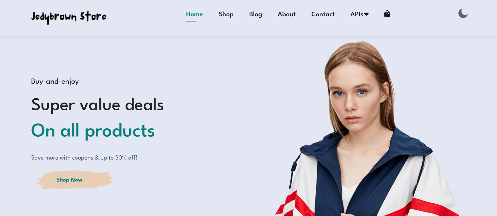
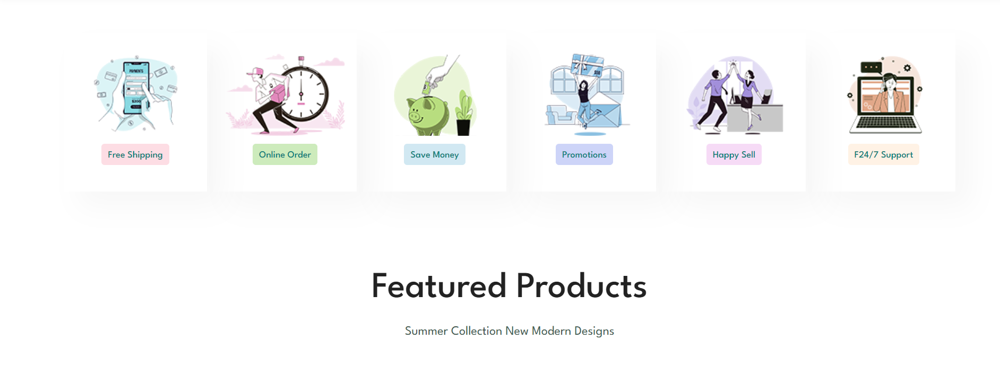
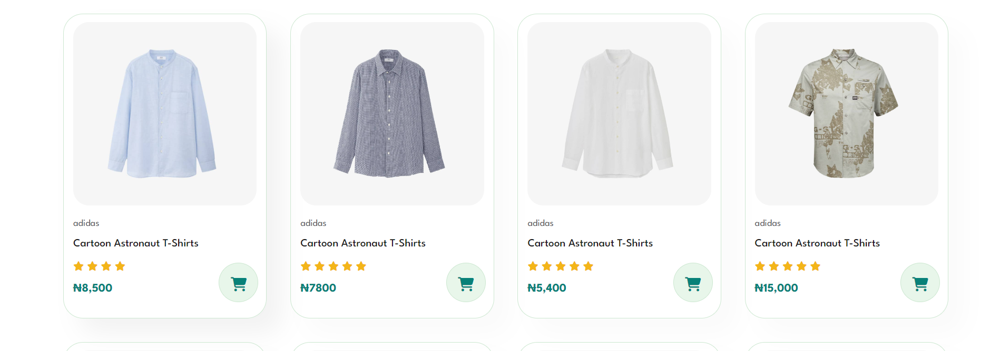
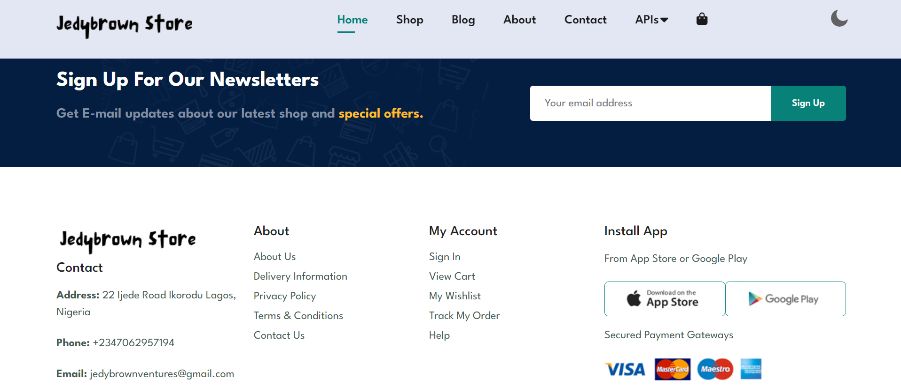
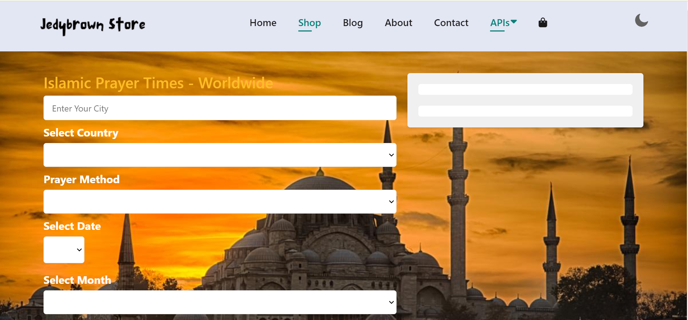

# E-commerce_Shop_And_API_Market

E-commerce_Shop_And_API_Market is a website that shows e-commerce web products and API endpoints.

## Version

1.0.1

## Stacks

1. HTML5
2. CSS3
3. Vanila JS
4. JQUERY 3.7.1 (npm install jquery@3.7.1)

## Dependencies

1. Bootstrap 5.3.3 (npm install bootstrap@5.3.3)
2. Font Awesome 6.5.0 (Using CDNJS)
3. Google font - League Spartan








## Domain

##### Static Version

<a href="https://e-commerce-shop-and-api-market.onrender.com/" target="_blank">E-commerce_Shop_And_API_Market</a>

##### Server Version

<a href="https://e-commerce-shop-and-api-market-2.onrender.com/" target="_blank">E-commerce_Shop_And_API_Market_2</a>

**Run with Localhost if your port is 5500**

**npm run dev - for development** or **npm start - for production**

```
http://127.0.0.1:5500/index.html

```

## Use Expressjs server

1. Entry point index.js
2. Launch a "web service" in render.com using github - create PORT 8080 environment varible for port

3. open account in freesqldatabase.com - use th credentials sent to your mail, then create enviriment variables to encode those credentials.

```
  host: process.env.MYSQL_HOST,
  user: process.env.MYSQL_USER,
  password: process.env.MYSQL_PASSWORD,
  database: process.env.MYSQL_DATABASE,
```
